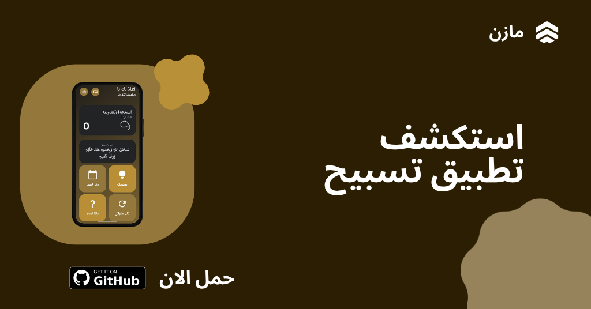

  

<h1 align="center">تسبيح - رفيقك اليومي للأذكار</h1>

  

  &nbsp;&nbsp;
  &nbsp;&nbsp;
  &nbsp;&nbsp;

تطبيق **تسبيح** هو رفيقك اليومي لأداء الأذكار بكل سهولة وراحة. تم بناء التطبيق باستخدام **Material Design 3 Expressive**، ليقدم واجهة عصرية، هادئة، ومريحة للعين مع رسوم متحركة انسيابية.

## 📱 المميزات التقنية
* **تجربة المستخدم (UI/UX):** واجهة مستخدم تعتمد على مكونات Material Design 3، مع دعم الوضعين الفاتح والداكن لراحة العين أثناء الاستخدام.
* **الأداء الأساسي:**
    * عداد دقيق جداً للأذكار.
    * تصميم خفيف الوزن يضمن عدم استهلاك موارد الجهاز أو البطارية.
* **التفاعل والرسوم المتحركة:**
    * رسوم متحركة انسيابية توفر استجابة تفاعلية عند التسبيح.

## 🧩 مميزات التطبيق
1. **واجهة هادئة:** تصميم صُمم خصيصاً لتقليل إجهاد العين والمساعدة على التركيز في الأذكار.
2. **دقة عالية:** تم تطوير نظام العد لضمان تسجيل كل ضغطة بدقة.
3. **تحديثات مستمرة:** إضافة ميزات جديدة وتحسينات دورية.

## 🛠 الأدوات والمكتبات
* **لغة البرمجة:** Kotlin.
* **بيئة التطوير:** Android Studio.
* **نظام التصميم:** Material Design 3 Expressive.

## 📥 تحميل التطبيق
يمكنك تحميل أحدث إصدار من تطبيق **تسبيح** مباشرة عبر الرابط التالي:

  

---

  <picture>
    <source media="(prefers-color-scheme: dark)" srcset="https://i.postimg.cc/KzPKjBNn/footer-Dark.png">
    <source media="(prefers-color-scheme: light)" srcset="https://i.postimg.cc/C5wRq5P9/footer-Light.png">
    
  </picture>

  <i>صُنع بكل حب بواسطة مازن</i>

