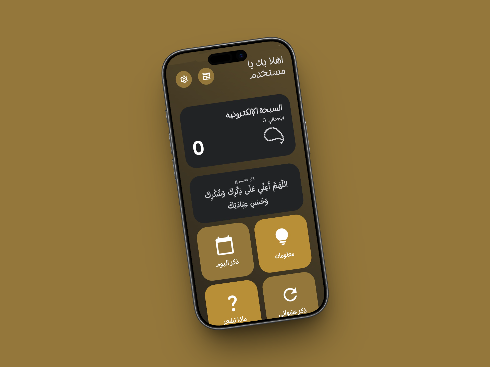
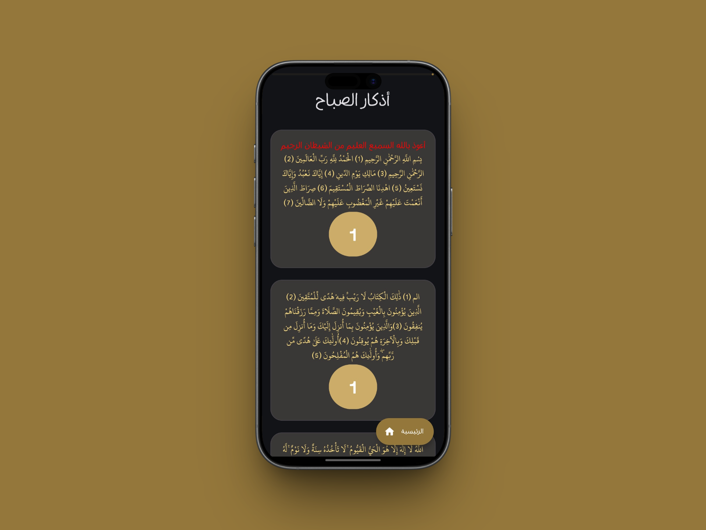
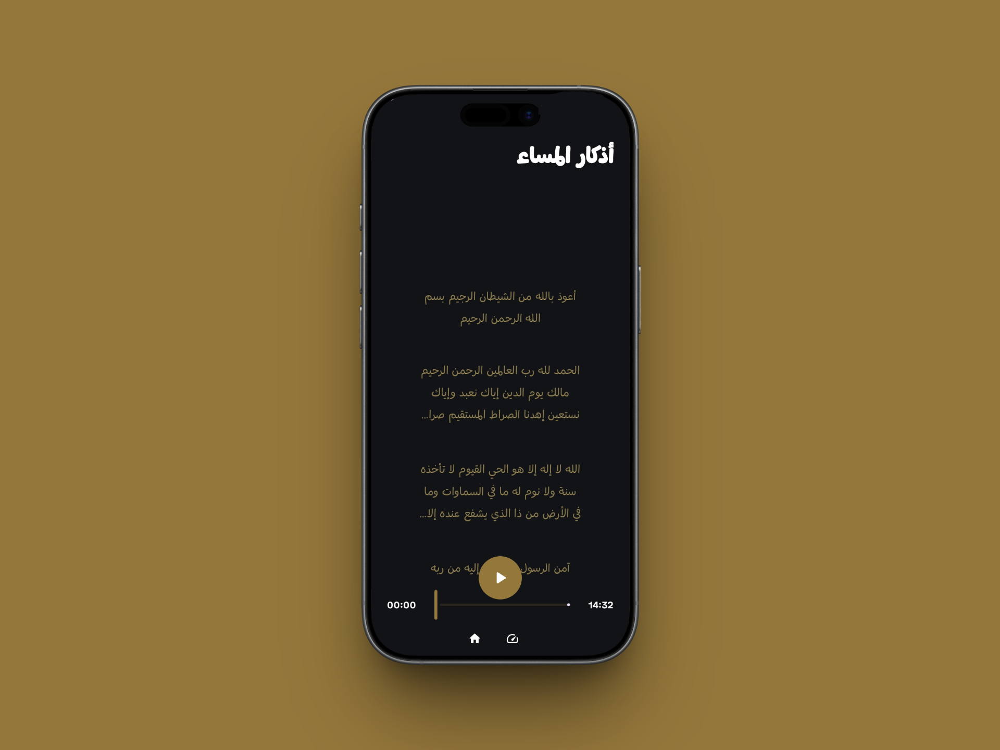
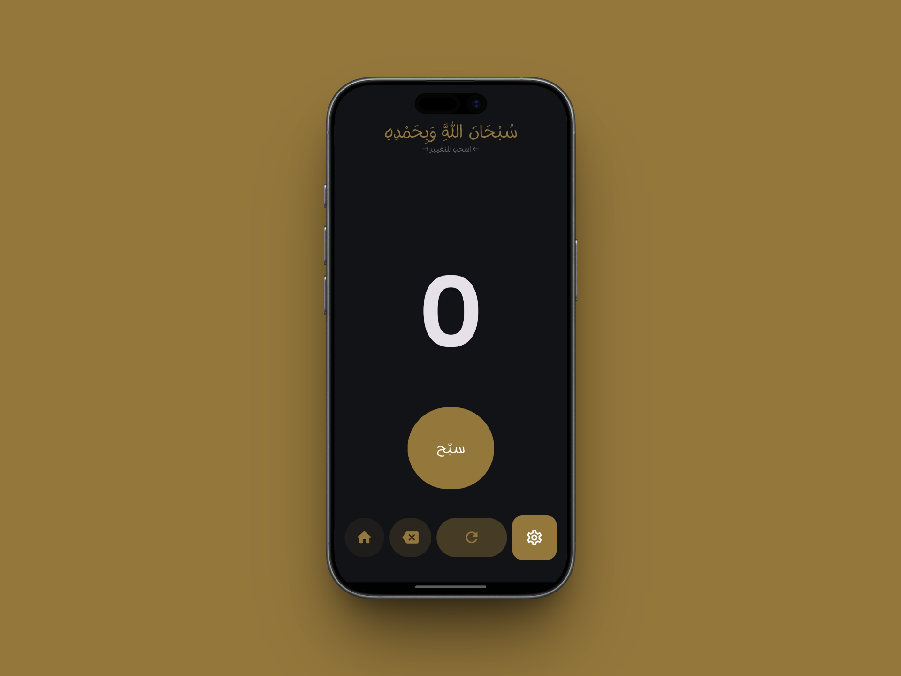
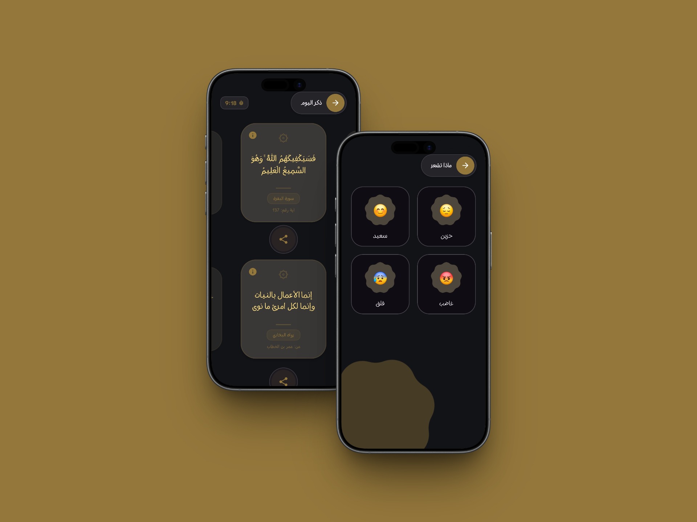

  

<h1 align="center">تسبيح - Tasbeeh</h1>

<b>رفيقك اليومي للأذكار.. تصميم جميل وتجربة مستخدم ذكية وسلسة</b>

  

  &nbsp;&nbsp;
  &nbsp;&nbsp;
  &nbsp;&nbsp;
  

---

تطبيق **تسبيح** هو تطبيق إسلامي، معمول بأحدث التقنيات عشان يساعدك تحافظ على ذكر الله في يومك بكل سهولة. التطبيق بيستخدم نظام **Material 3 Expressive**، عشان يقدملك واجهة هادية، مريحة للعين، وحركات (Animations) انسيابية تخلي استخدام التطبيق متعة.

## ✨ ميزات التطبيق (اللي هتحبها)

### 🔊 أذكار الصباح والمساء صوتياً
* **الأذكار بالصوت:** أذكار الصباح والمساء متاحة بالصوت وبجودة صوت عالية ونقية.
* **التشغيل في الخلفية:** إمكانية سماع الأذكار براحتك، والصوت بيفضل شغال حتى لو الشاشة مقفولة أو بتستخدم أي تطبيق تاني.
* **التحكم من الإيربودز:** إمكانية توقيف وتشغيل الأذكار الصوتية مباشرة من الـ AirPods بتاعتك من غير ما تحتاج تفتح الموبايل.

### 🎨 واجهة مستخدم شياكة (UI/UX)
* **تصميم Material 3 Expressive:** واجهة عصرية ومبهجة مبنية على أحدث ستايل من جوجل لتجربة بصرية مريحة.
* **شريط تقدم ويفي (Wavy Progress):** شريط تموجي شكله شيك ومميز في أغلب الشاشات عشان تتابع إنجازك في الأذكار أول بأول.
* **دعم الوضع الفاتح والداكن:** وضع فاتح مريح للعين ومبهج، ووضع ليلي متناسق يخلي الكلام والعناصر واضحة جداً في الضلمة ومن غير إجهاد للعين.

### 🧠 ميزات ذكية وتفاعلية
* **خاصية "حاسس بإيه؟":** قسم ذكي بيقترح عليك أذكار وأدعية دقيقة تناسب حالتك النفسية ومودك الحالي.
* **الذكر العشوائي:** شاشة متنوعة بتعرض آيات، أحاديث، وأذكار متجددة، وفيها زرار مشاركة مخصوص عشان تنشر الخير بسهولة.
* **التمرير التلقائي (Auto-Scroll):** ميزة قراءة أذكار الصباح والمساء بسلاسة من غير ما تحتاج تسحب الشاشة بإيدك.
* **سبحة إلكترونية مطورة:** نظام عد دقيق جداً بيسجل كل ضغطة بسرعة ومبيفوتش حاجة.
* **إشعارات ذكية:** نظام تنبيهات شغال في الخلفية بيفكرك بالذكر طول اليوم بذكاء.

### ⚙️ بنية تقنية على مية بيضا
* **تحديث تلقائي ذكي:** التطبيق مربوط بسيرفرات GitHub بشكل آمن وسريع، وأول ما بينزل إصدار جديد، الموبايل بيحدث نفسه بنفسه من جوه التطبيق من غير ما تحتاج تروح للمتصفح وتحمل ملف الـ APK يدوي.
* **دعم واسع للموبايلات:** الأكواد الأساسية مكتوبة بكفاءة عالية تخليه يدعم أجهزة أكتر، والحد الأدنى لنظام التشغيل هو **Android 11** عشان يشتغل بسلاسة عند أغلب الناس.
* **خفيف ومش بياكل البطارية:** معالجة البيانات واستهلاك الموارد في الخلفية معمول بحرفية عشان التطبيق يفضل سريع وزي الفل وفي نفس الوقت يحافظ على بطارية موبايلك.
* **بيانات موثوقة ومتراجعة:** كل الآيات القرآنية، الأحاديث النبوية، والتشكيل مكتوبة ومراجعة بدقة عالية جداً عشان تضمن قراءة صحيحة وخالية من أي أخطاء إملائية.

---

## 📸 لقطات من التطبيق (Screenshots)

| الواجهة الرئيسية | قائمة الأذكار | الاستماع للأذكار | السبحة الذكية | المزيد والإعدادات |
| :---: | :---: | :---: | :---: | :---: |
|  |  |  |  |  |

---

## 🛠 الأدوات والمكتبات المستخدمة

* **لغة البرمجة:** Kotlin.
* **بيئة التطوير:** Android Studio.
* **نظام التصميم:** Material 3 Expressive.

---

## 📥 تحميل التطبيق

تقدر تحمل أحدث إصدار من التطبيق مباشرة بصيغة APK من الرابط ده، وعيش مع ميزة التحديث التلقائي الذكي بعد كدة:

  

---

## ⭐ ادعم المشروع

لو عجبك تطبيق **تسبيح** وحسيت إنه مفيد ليك، ما تبخلش علينا بنجمة (**Star**) فوق ع اليمين! دعمك ده هو اللي بيساعد التطبيق يوصل لناس أكتر وبيشجعني أطور فيه وأضيف ميزات جديدة طول الوقت.

---

  <picture>
    <source media="(prefers-color-scheme: dark)" srcset="https://i.postimg.cc/KzPKjBNn/footer-Dark.png">
    <source media="(prefers-color-scheme: light)" srcset="https://i.postimg.cc/C5wRq5P9/footer-Light.png">
    
  </picture>

